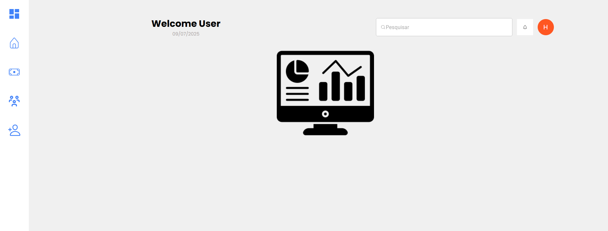
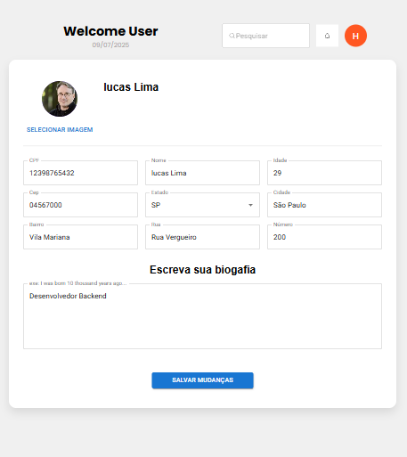
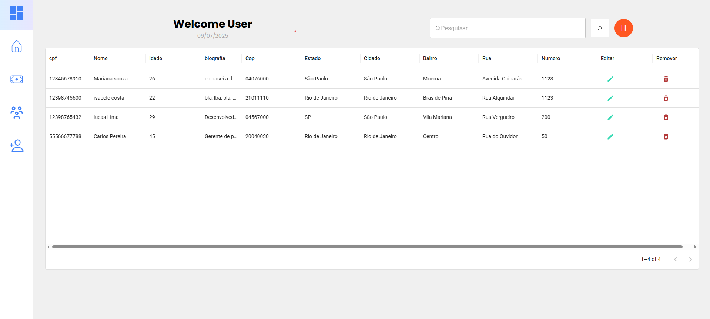

# 👤 Perfil de Usuário - Sync360

Este projeto é um desafio técnico cujo objetivo é desenvolver uma interface de perfil de usuário com funcionalidades completas de **visualização**, **edição**, **cadastro** e **armazenamento em banco de dados**.

---

## ✨ Funcionalidades

- CRUD completo de usuários com nome, CPF, idade, imagem e endereço
- Exibição de usuários ativos em uma tabela interativa
- Máscaras aplicadas para CPF e CEP
- Preenchimento automático de endereço a partir do CEP (via API)
- Upload de imagem de perfil
- Validação de campos obrigatórios
- Integração com banco de dados via API

---

## 🧰 Tecnologias Utilizadas

### Frontend

- [React](https://reactjs.org/) com [Vite](https://vitejs.dev/)
- [Material UI](https://mui.com/)
- React Hooks
- [Axios](https://axios-http.com/)

### Backend

- [Node.js](https://nodejs.org/) com [Express](https://expressjs.com/)
- [MySQL](https://www.mysql.com/)

---

## 🚀 Como rodar o projeto localmente

### 1. Clone o repositório

```bash
    git clone https://github.com/seu-usuario/seu-repositorio.git
cd seu-repositorio
```

---

## 2. Instale as dependências

### Frontend

```bash
cd front-end
npm install

cd backend
npm install

```

---

## 3. Configure os banco de dados

###

    - DB_HOST=localhost  
    - DB_USER=root
    - DB_PASSWORD=sua_senha
    - DB_NAME=nome_do_banco

\*\*OBS o Script de criação do banco estar disponivel em db.

## 4.Execute o projeto

    Para iniciar tanto o frontend quanto o backend ao mesmo tempo, usamos o comando npm run dev que utiliza o pacote concurrently para rodar os dois servidores juntos.

No diretório raiz do projeto, execute:

```bash
npm run dev
```

Esse comando vai iniciar:

O backend (API) rodando normalmente (ex: na porta 3000)

O frontend (interface React) rodando com Vite (ex: na porta 5173)

### 5. Acesse o sistema
    http://localhost:5173

"scripts": {
  "dev": "concurrently \"npm run start --prefix backend\" \"npm run dev --prefix front-end\""
}

### 6. Imagens do sistema
🖼️ Imagens do sistema
Aqui você pode adicionar prints de tela para ilustrar a interface do seu projeto. Exemplo:






